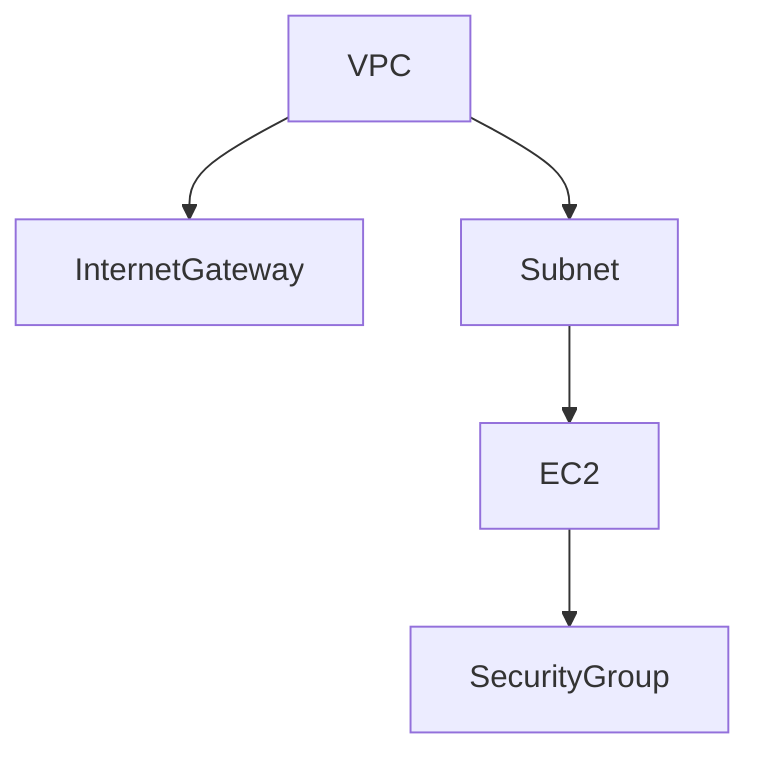

# terraform-aws-bootstrap

## 📖 Overview

This project provisions a basic AWS cloud stack using Terraform. It creates a VPC, public subnet, and an EC2 instance configured to run an NGINX web server and serve a public webpage — ideal for Infrastructure-as-Code (IaC) beginners.

## 🧰 Tools Used

- Terraform
- AWS Free Tier
- VS Code
- GitHub
- Mermaid.js (for diagrams)

## 🧱 Prerequisites

To run this project locally, you'll need:

- [Terraform](https://developer.hashicorp.com/terraform/downloads)
- [AWS CLI](https://docs.aws.amazon.com/cli/latest/userguide/install-cliv2.html)
- An [AWS account](https://aws.amazon.com/free)
- An IAM user with programmatic access configured via `aws configure`
- [Git](https://git-scm.com/)
- (Optional) [VS Code](https://code.visualstudio.com/) with the Terraform and Mermaid extensions

## 📂 Project Structure

```
terraform-aws-bootstrap/
├── mermaid_diagrams          # contains mermaid.js diagrams  
├── main.tf                   # Main infrastructure configuration
├── variables.tf              # Input variables
├── outputs.tf                # Output values (e.g., public IP)
├── terraform.tfvars          # Variable values (e.g., AMI ID), normally wouldn't commit this, but nothing confidential now
├── .gitignore                # Files to ignore (e.g., .terraform/)
├── README.md                 # Project overview
```

## 🌐 Architecture Diagram




## 🚀 How to Use

```bash
git clone https://github.com/YOUR_USERNAME/terraform-aws-bootstrap.git
cd terraform-aws-bootstrap
terraform init
terraform plan
terraform apply
```

> You'll need AWS credentials configured in your environment using `aws configure`.

## 📦 Outputs

- EC2 Public IP (to access via browser or SSH)

## 🔍 Example Result

After running `terraform apply`, visit the browser-accessible IP:

**Example:** `http://3.227.8.150`

You should see:
Hello from Terraform!


## 🧪 Development Notes

- This project is configured to stay within AWS Free Tier limits.
- No Python or virtual environment is required unless using wrapper scripts or automation in the future.
- For multi-environment support (e.g., dev, staging), modular structure will be added later.

## ✅ Next Steps

- Add private subnets + NAT gateway
- Add S3 + IAM roles
- Explore remote state backends
